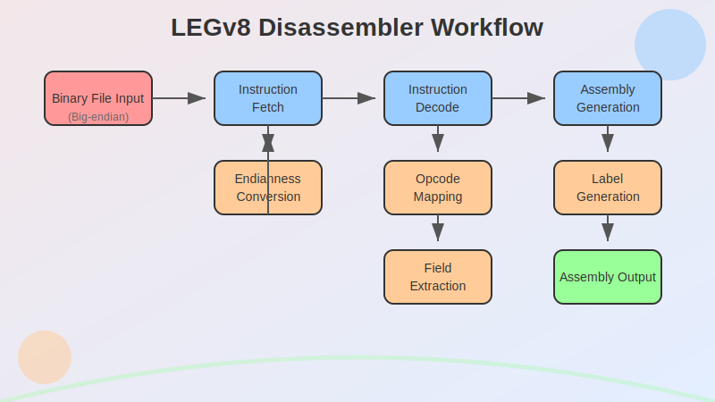

# LEGv8 Disassembler

## Table of Contents
1. [Project Overview](#project-overview)
2. [Features](#features)
3. [Workflow](#workflow)
4. [Technical Details](#technical-details)
5. [Installation](#installation)
6. [Usage](#usage)
7. [Supported Instructions](#supported-instructions)
8. [Implementation Details](#implementation-details)
9. [Testing](#testing)
10. [Performance Considerations](#performance-considerations)
11. [Future Improvements](#future-improvements)
12. [Contributing](#contributing)
13. [License](#license)
14. [Acknowledgments](#acknowledgments)

## Project Overview

This LEGv8 Disassembler is a powerful tool designed to reverse-engineer binary files containing LEGv8 instructions. It takes as input a binary file with LEGv8 machine code encoded in big-endian byte order and outputs the corresponding assembly code. This project is particularly useful for debugging, reverse engineering, and educational purposes in the field of computer architecture.

## Features

- **Comprehensive Instruction Support**: Handles a wide range of LEGv8 instructions, including arithmetic, logical, branch, and memory operations.
- **Custom Instruction Handling**: Supports custom instructions like PRNT, PRNL, DUMP, and HALT, which are specific to the LEGv8 emulator used in educational settings.
- **Intelligent Label Generation**: Automatically generates new label names for branch instructions, maintaining the logical flow of the disassembled code.
- **Flexible Input Handling**: Processes binary files containing any number of contiguous instructions.
- **Endianness Management**: Correctly handles big-endian encoded instructions and converts them to the host machine's endianness.
- **Detailed Output**: Provides a clear, readable output of the disassembled instructions, including generated labels and instruction addresses.

## Workflow

The disassembler follows a streamlined process to convert binary instructions into assembly code:



1. **Binary File Input**: The program reads the input binary file.
2. **Instruction Fetch**: It fetches 32-bit instructions from the file, handling endianness conversion.
3. **Instruction Decode**: Each instruction is decoded to identify its type and extract relevant fields.
4. **Assembly Output**: The decoded instruction is converted to its assembly representation and output.

## Technical Details

- **Language**: Python 3.x
- **Input Format**: Binary file containing 32-bit LEGv8 instructions in big-endian format
- **Output Format**: Text-based LEGv8 assembly code
- **Bit Manipulation**: Utilizes bitwise operations for efficient field extraction from instructions

## Installation

1. Ensure you have Python 3.x installed on your system.
2. Clone this repository:
   ```
   git clone https://github.com/Abhay-2004/LEGv8-Disassembler.git
   ```
3. Navigate to the project directory:
   ```
   cd LEGv8-Disassembler
   ```

## Usage

1. To run the disassembler:
   ```
   python PA2.py <path_to_binary_file>
   ```
   or use the provided shell script:
   ```
   sh run.sh <path_to_binary_file>
   ```

2. The disassembled output will be printed to the terminal.

Example:
```
$ python PA2.py test_binary.bin
L1: ADD X1, X2, X3
L2: ADDI X4, X5, #100
L3: B L7
L4: LDUR X6, [X7, #8]
L5: STUR X8, [X9, #-16]
L6: HALT
L7: SUB X10, X11, X12
```

## Supported Instructions

The disassembler supports the following LEGv8 instructions:

### Arithmetic Operations
- ADD, ADDI, SUB, SUBI, SUBIS, SUBS, MUL

### Logical Operations
- AND, ANDI, EOR, EORI, ORR, ORRI

### Shift Operations
- LSL, LSR

### Branch Operations
- B, B.cond (with all condition codes: EQ, NE, HS, LO, MI, PL, VS, VC, HI, LS, GE, LT, GT, LE)
- BL, BR, CBNZ, CBZ

### Memory Operations
- LDUR, STUR

### Custom Operations
- PRNT, PRNL, DUMP, HALT

## Implementation Details

### Instruction Decoding
- The program reads 4 bytes at a time from the binary file to construct 32-bit instructions.
- Bitwise operations are used to extract different fields from the instruction, such as opcode, registers, and immediate values.
- The extracted fields are then used to determine the instruction type and its operands.

### Endianness Handling
- The program assumes the input file is in big-endian format.
- It converts the read bytes to the host machine's endianness for correct interpretation.

### Label Generation
- For branch instructions, the program calculates the branch target address.
- It generates new label names based on the instruction count and branch target.

### Opcode Mapping
- A dictionary maps binary opcodes to their corresponding instruction mnemonics.
- This allows for easy expansion of supported instructions in the future.

## Testing

To ensure the accuracy of the disassembler, it's recommended to test it with a variety of input files:

1. Create test binary files using the LEGv8 assembler.
2. Run the disassembler on these test files.
3. Compare the output with the original assembly code.
4. Verify that the disassembled code, when reassembled, produces the same binary as the input.

## Performance Considerations

- The disassembler uses efficient bitwise operations to decode instructions, ensuring fast processing even for large input files.
- Memory usage is optimized by processing instructions one at a time, rather than loading the entire file into memory.

## Future Improvements

- Implement support for additional LEGv8 instructions as they are introduced.
- Add an option to output the disassembled code to a file instead of just the terminal.
- Develop a graphical user interface for easier interaction with the disassembler.
- Implement more sophisticated analysis of branch instructions to improve label naming and code structure understanding.
